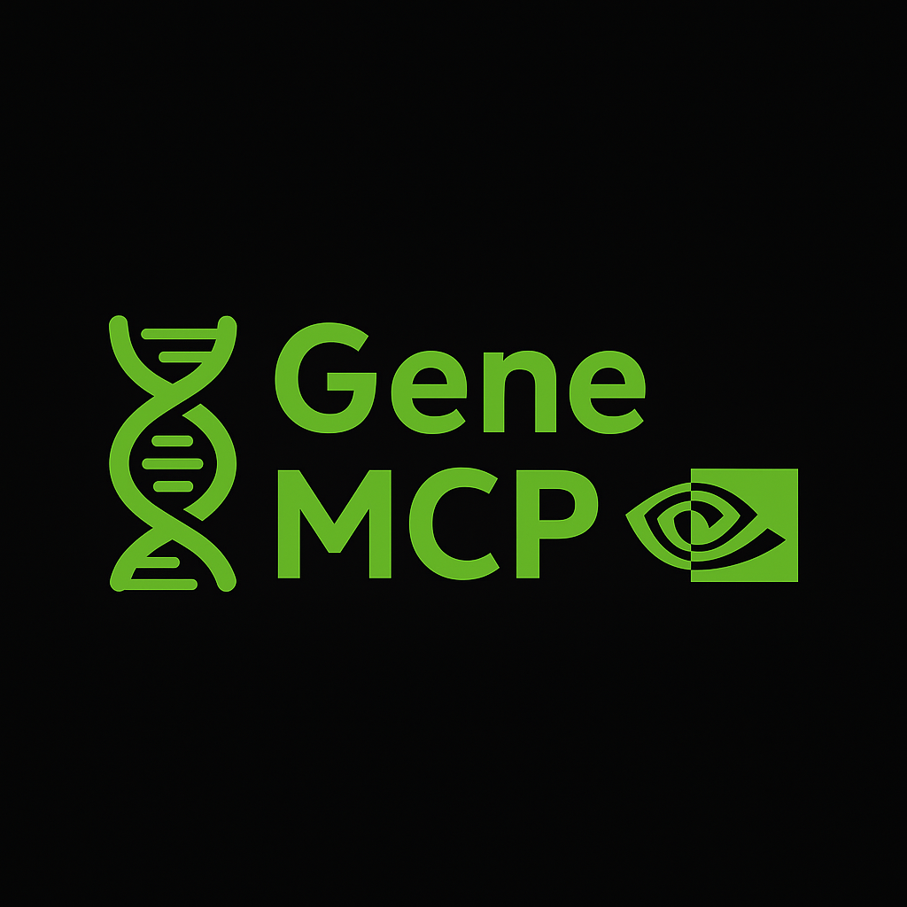

# GeneMCP: NVIDIA AgentIQ Hackathon Submission - Matthew Sayer


**GeneMCP is a Model Context Protocol (MCP) server developed as a submission for the [NVIDIA AgentIQ Hackathon](https://developer.nvidia.com/agentiq-hackathon).**

This project showcases a small suite of tools leveraging NVIDIA NIMs (NVIDIA Inference Microservices) and other APIs to perform comprehensive genetic research, analysis, and interaction, all orchestrated through the Model Context Protocol. 

In layman's terms, this will let a doctor take someone's DNA file and check if they're vulnerable to developing certain conditions. You can then discuss in depth to figure out the person's vulnerabilities, and what they should do - how to prepare and what medication to take or avoid based on their genetic profile. The possibilities are not limited. You can use the chat tool to directly invoke the Palmyra model, or the Nemotron/Deepseek models - I recommend using Palmyra as that has has been specially trained for medical use.

There is also a little extra which can generate DNA sequences - not something a doctor should do, but an example of the power of the Nvidia NIM toolset.

Sign up for an Nvidia account to get a free dev API key: https://build.nvidia.com/

# **IMPORTANT - TO USE YOUR OWN DNA FOR ANALYSIS - READ THIS**
You can use your own DNA file AS A .CSV to have something to analyse, if you wish to use the DNA analysis tool. It should have these headers: rsid,chromosome,position,allele1,allele2. You can tell the tool the path to the file on your local machine for it to use it. If you've already had a DNA test with Ancestry DNA you should have one.

**OR you can use the file under dna_sample which I have random generated, for an example to try out.**

## Core Features & Toolset

GeneMCP integrates several key tools to offer a robust platform for genetic exploration:

1.  **Deep Genetic Research (`deep_genetic_research`)**:
    *   This tool orchestrates an agentic workflow to investigate genetic indicators for specified medical conditions.
    *   **GWAS Catalogue Integration**: Queries the GWAS Catalogue ([`find_rsids_from_gwas_catalog`](Nvidia_Demo_MCP_Server/tools/deep_research.py)) to identify relevant genetic variants (rsIDs) associated with the condition.
    *   **Web Research**: Performs targeted web searches using the Google Search API ([`search_web_for_rsids_or_condition`](Nvidia_Demo_MCP_Server/tools/deep_research.py)) for these rsIDs or the condition itself to gather contextual information.
    *   **Report Compilation**: Consolidates findings from GWAS and web research into a structured JSON report ([`summarise_findings_core`](Nvidia_Demo_MCP_Server/tools/deep_research.py) and [`compile_report_node`](Nvidia_Demo_MCP_Server/tools/deep_research.py)).
    *   **AI-Powered Summarisation**: Utilises **NVIDIA's Palmyra-70b NIM** ([`llm_analyse_report`](Nvidia_Demo_MCP_Server/tools/deep_research.py) via [`chat_with_model`](Nvidia_Demo_MCP_Server/tools/chat.py)) to generate an expert-level summary of the compiled research report, highlighting key genetic insights.

2.  **Patient DNA Risk Assessment (`assess_patient_genetic_risk_profile`)**:
    *   Analyses a patient's DNA data (e.g., from a CSV file like [Nvidia_Demo_MCP_Server/resources/mattDNA.csv](Nvidia_Demo_MCP_Server/resources/mattDNA.csv)) against pre-compiled genetic indicators (RSIDs).
    *   Calculates Polygenic Risk Scores (PRS) for specified conditions, offering insights into an individual's genetic predisposition.
    *   Identifies specific variants in the patient's DNA that contribute to the risk profile.

3.  **DNA Generation (`dna_generator`)**:
    *   Leverages the **NVIDIA Evo2-40B NIM** to generate novel DNA sequences based on a provided input sequence.
    *   Useful for synthetic biology research, data augmentation, or exploring sequence variations.

4.  **Expert Chat (`chat_with_model`)**:
    *   Provides a flexible interface for conversational AI using various models accessible via the NVIDIA API.
    *   Can be used for discussing research findings, asking follow-up questions, or general medical/genetic enquiries, with the ability to specify models like Palmyra-70b for domain-specific expertise.

## NVIDIA NIM Integration

GeneMCP harnesses the power of NVIDIA NIMs to deliver specialised AI capabilities:

*   **Palmyra-70b**:
    *   **Why it's used**: This large language model, with 70 billion parameters, is part of the NVIDIA NIM collection and is specialised for the medical domain. Its training on extensive medical literature makes it exceptionally proficient at understanding, interpreting, and summarising complex biomedical and genetic information.
    *   **Application**: In GeneMCP, Palmyra-70b is crucial for the `deep_genetic_research` tool, where it distils comprehensive research reports into concise, actionable, and expert-quality summaries.

*   **Evo2-40B**:
    *   **Why it's used**: Evo2-40B is another NVIDIA NIM specifically designed for biological sequence generation. It understands the patterns and structures of DNA.
    *   **Application**: This NIM powers the `dna_generator` tool, enabling the creation of new DNA sequences, which can be invaluable for research, testing hypotheses, or developing synthetic constructs.

*   **Deepseek-R1**:
    *   **Why it's used**: This shows the option for usage of Deepseek via Nvidia NIM.
    *   **Application**: This NIM is part of the the `chat_to_model` tool.

    

## Why GeneMCP is Useful

*   **Comprehensive Genetic Analyses**: Offers an integrated workflow from broad genetic research to personalised DNA risk assessment.
*   **AI-Driven Insights**: Employs state-of-the-art NVIDIA NIMs to provide deeper, more nuanced insights than traditional analysis methods alone. Palmyra-70b offers expert-level summarisation of medical texts, while    Evo2-40B allows for novel biological sequence generation.
*   **Automated & Streamlined Research**: Significantly reduces the manual effort involved in gathering, processing, and interpreting genetic data from sources like the GWAS Catalogue and web searches.
*   **Facilitating Personalised Medicine**: By analysing individual DNA (e.g., [Nvidia_Demo_MCP_Server/resources/mattDNA.csv](Nvidia_Demo_MCP_Server/resources/mattDNA.csv)) for risk factors, GeneMCP supports the move towards more personalised healthcare strategies.
*   **Accelerating Research & Development**: Provides researchers with tools to quickly investigate genetic links, generate synthetic DNA for experiments, and discuss findings with an AI expert.

## Running locally

Prerequisites:
* Python 3.11.9 (as specified in [Nvidia_Demo_MCP_Server/pyproject.toml](Nvidia_Demo_MCP_Server/pyproject.toml) and [Nvidia_Demo_MCP_Server/.python-version](Nvidia_Demo_MCP_Server/.python-version))
* [uv](https://docs.astral.sh/uv/getting-started/installation/) (Python package installer and virtual environment manager)
* An `.env` file in the `Nvidia_Demo_MCP_Server` directory with your API keys (see [Nvidia_Demo_MCP_Server/.env.example](Nvidia_Demo_MCP_Server/.env.example)):
    *   `NVIDIA_API_KEY`
    *   `GOOGLE_SEARCH_API_KEY`
    *   `GOOGLE_CUSTOM_SEARCH_CX`

Run the server locally:

```bash
# Navigate to the Nvidia_Demo_MCP_Server directory
cd Nvidia_Demo_MCP_Server

# Create and activate virtual environment
uv venv

# Install dependencies
uv sync

# Run the server (main.py)
uv run fastapi dev main.py

```

## VS Code MCP Configuration (`.vscode/mcp.json`)

To connect the MCP extension in VS Code to your local GeneMCP server:

```json
// filepath: .vscode/mcp.json
{
    "servers": {
        "NVIDIA_HACKATHON_GENE_MCP": {
            "type": "sse",
            "url": "http://localhost:8000/sse"
        }
    }
}
```

This configuration tells the MCP extension to communicate with the FastAPI server ([`main.py`](Nvidia_Demo_MCP_Server/main.py)) running at the specified URL using Server-Sent Events (SSE) for real-time message exchange.
